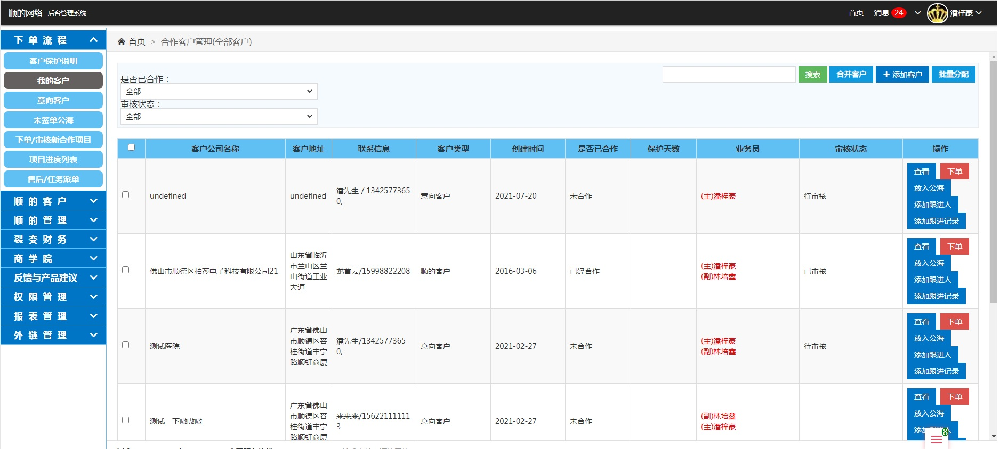

### 我的客户 :id=my_pocket <!-- {docsify-ignore} -->
* 该功能是查看自己跟进的客户  [查看](otherfunction/customer_msg?id=check_customer)  [下单](otherfunction/order_msg?id=add_order)   [添加跟进人](otherfunction/customer_msg?id=add_vis_msg)   [添加跟进记录](otherfunction/customer_msg?id=add_vis_msg)
放入公海 	

