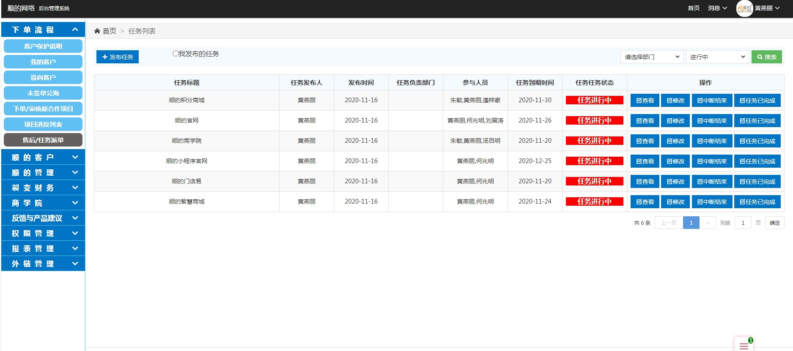
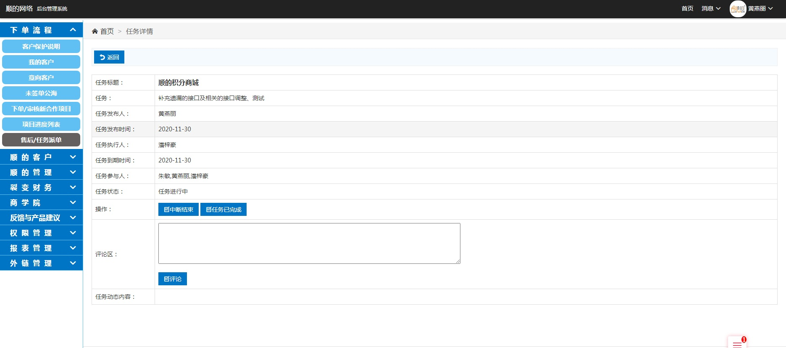
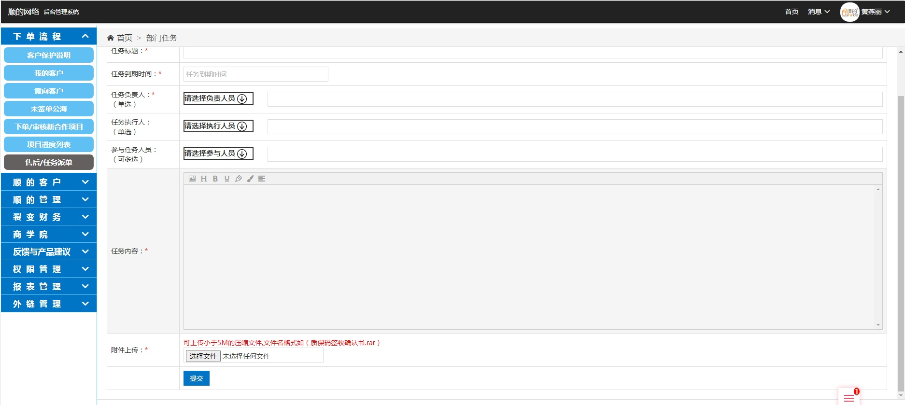
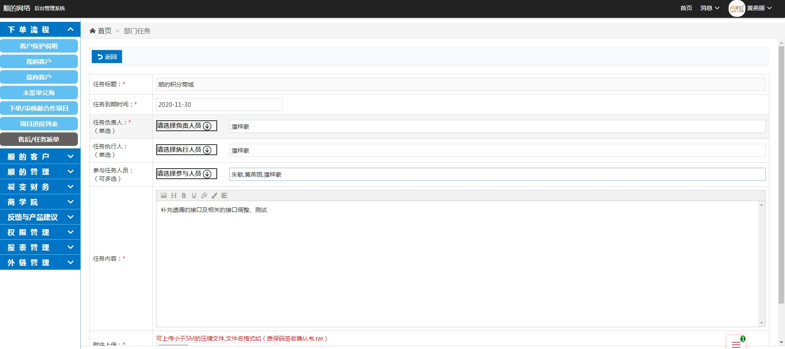

### 售后任务派单 :id=task_list <!-- {docsify-ignore} -->
* 该功能查看自己发布的新任务列表,以及自己相关参与的项目

### 查看 :id=task_check
* 该功能查看任务相关内容,附件查看

### 发布任务/修改 :id=task_update
* 该功能是添加任务内容的添加和修改

### 中断结束 :id=task_paststop
* 该功能是由发布人中断任务

### 任务已完成 :id=task_finsh
* 该功能是由完成人或发布人进行任务完成确认