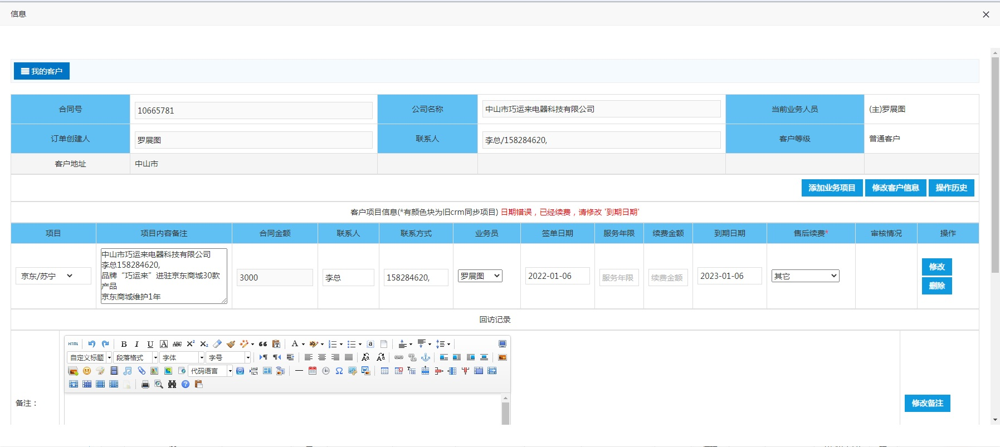
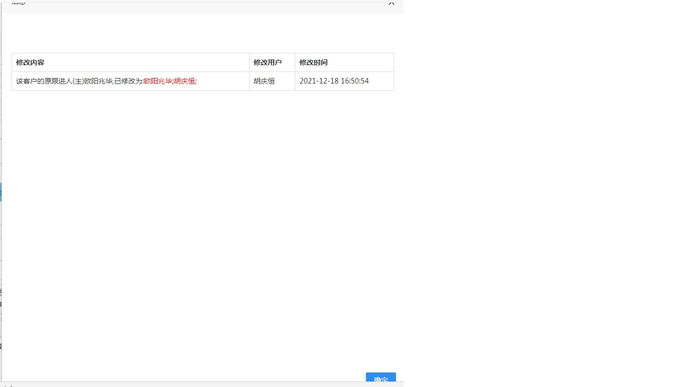
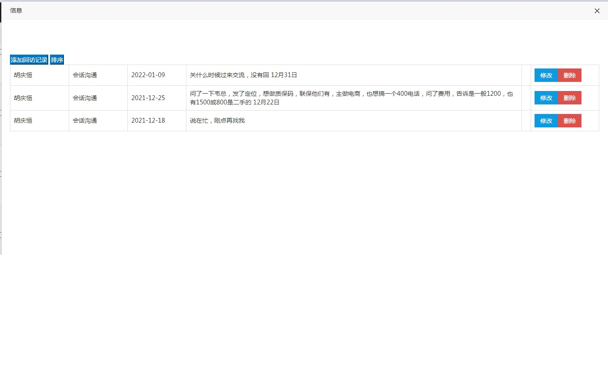
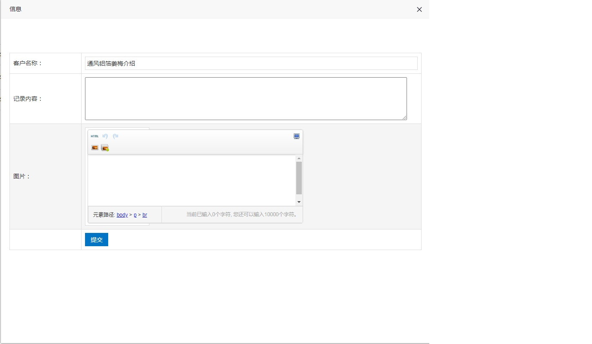
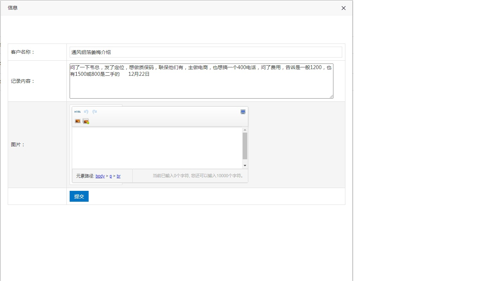
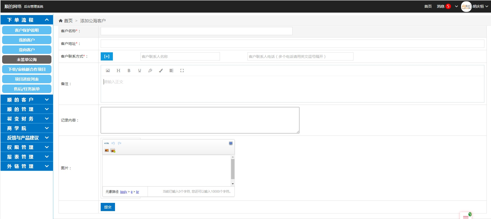
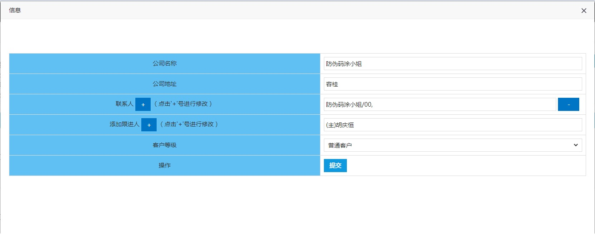
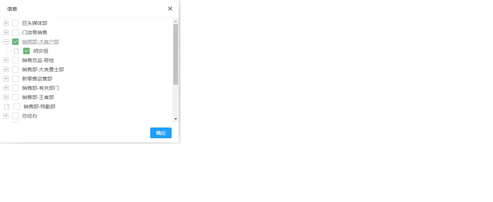

### 客户信息 :id=cus_msg <!-- {docsify-ignore} -->

* 该功能是对客户一些功能性的操作	

### 客户查看 :id=check_customer
* 查看客户信息,项目内容的修改查看,备注内容的修改查看

### 客户操作历史 :id=history_customer
* 客户的跟进 联系人 地址 名称的修改内容记录

### 回访记录  :id=add_vis_record
* 查看客户回访记录,添加/修改客户的回访记录

### 添加客户信息 :id=up_customer
* 添加修改客户信息,如地址,客户姓名,客户等级

### 添加跟进人 :id=add_vis_msg
* 添加客户跟进人

### 添加联人 :id=add_contacts_msg
* 添加客户联系人

		