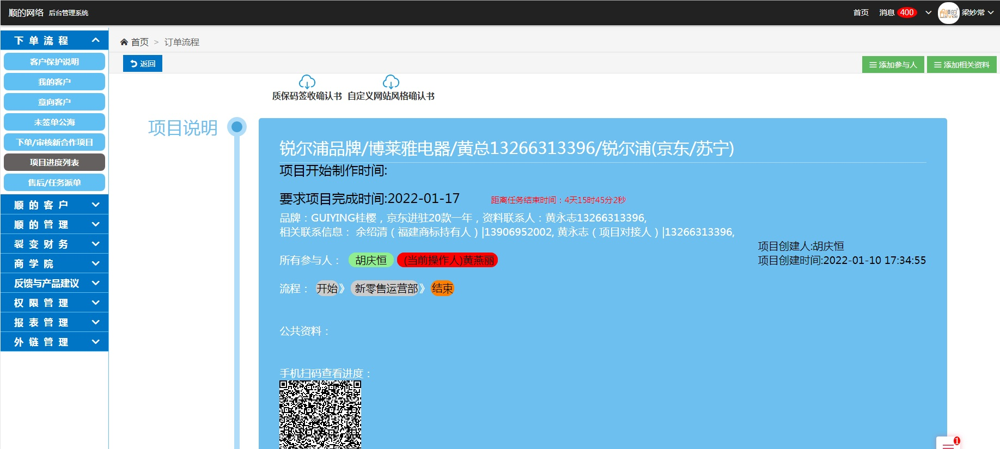
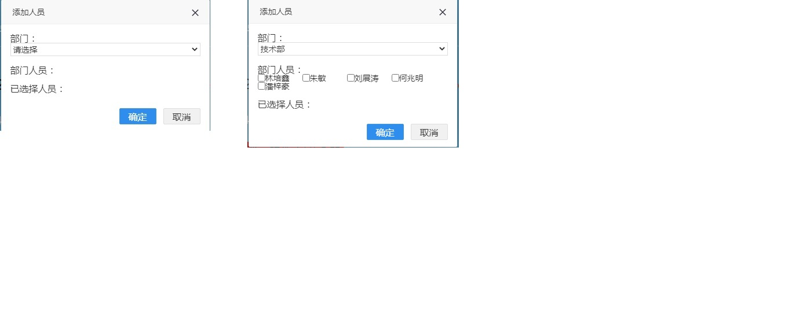
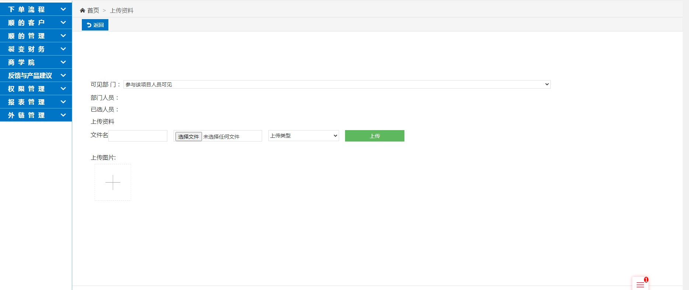

### 项目进度列表 :id=process_list <!-- {docsify-ignore} -->
* 该功能是查看订单项目进度流程,根据财务派发的流程一步一步下去的   [添加流程](otherfunction/customer_msg?id=check_customer)  [修改流程](otherfunction/order_msg?id=add_order)   [查看项目进度](order/process_list?id=check_process)

### 查看项目进度 :id=check_process
* 该功能查看部门的流程去到那里,流程的一些操作功能

### 添加参与人 :id=add_process_user
* 该功能添加流程的参与人,添加后会把该人员加到这个订单流程里面

### 添加任务相关资料 :id=add_process_user
* 该功能添加任务相关资料,添加的资料可以提供给所以参与该流程的人员查看

